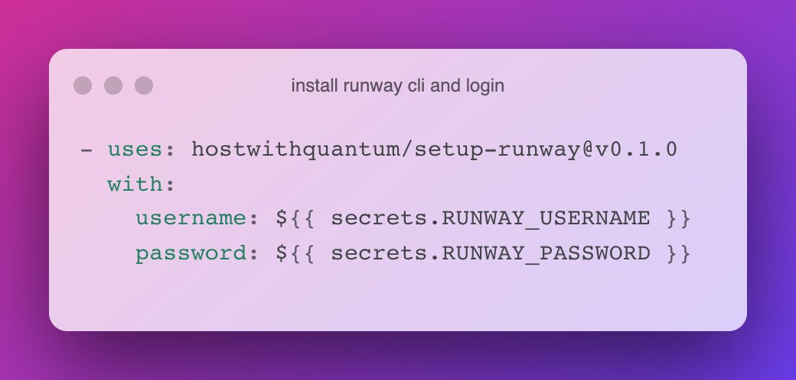

# hostwithquantum/setup-runway



A GitHub action to setup the runway CLI! Questions, issues? Please use discussions or the issue tracker on the repository. If you like what you see here, **we appreciate a** :star: and if you'd subscribe to [(our monthly) mailing list](https://runway.planetary-quantum.com/) to stay in the loop!

## Quick Start

```yaml
- uses: hostwithquantum/setup-runway@v0.1.0
  with:
    username: ${{ secrets.RUNWAY_USERNAME }}
    password: ${{ secrets.RUNWAY_PASSWORD }}
- run: runway whoami
```

## Options

Currently supported options:

| option        | default value | description                               |
|---------------|---------------|-------------------------------------------|
| username      | `<none>`      | username/email for runway                 |
| password      | `<none>`      | password for runway                       |
| public-key    | `<none>`      | use this to add a new key to your account |
| download-link | ...           | this is a link to our S3-storage          |
| log-level     | `error`       | debug, info, warn, error                  |
| version       | `latest`      | will be added before `v1`                 |

> Since we are pre-1.0, latest is fine. We still do not want to break your workflows. But sometimes BC breaks are necessary. Because they usually involve our client and APIs, using latest helps to keep all interruptions to a minimum.

## Examples

### Setup the runway CLI

This is an example how to setup the runway CLI and then how to deploy your app `cool-app`.

Once you have the client setup, you can run commands and play around with output and so on. To keep it simple, we're only deploying the code. :) Since the app exists already on runway we use the `runway gitremote` command to initialize the setup.

```yaml
# .github/workflows/release.yml
---
name: release

on:
  push:
    tags:

jobs:
  deploy:
    runs-on: ubuntu-latest
    env:
      YOUR_APPLICATION_NAME: cool-app
    steps:
      - uses: actions/checkout@v3
      - name: create public/private key on GHA
        run: |
          mkdir -p ~/.ssh/
          echo ${{ secrets.PRIVATE_KEY }} > ~/.ssh/id_rsa
          echo ${{ secrets.PUBLIC_KEY }} > ~/.ssh/id_rsa.pub
          chmod 0600 ~/.ssh/id_rsa*
      - uses: hostwithquantum/setup-runway@v0.1.0
        with:
          username: ${{ secrets.RUNWAY_USERNAME }}
          password: ${{ secrets.RUNWAY_PASSWORD }}
      - run: runway -y gitremote -a ${YOUR_APPLICATION_NAME}
      - run: runway -y app deploy
```

### Running e2e tests

GitHub Actions provides a robust and comprehensive environment. In the following workflow we leverage some of its context in form of `${{ github.run_id }} to deploy your app with a unique name. Once deployed, you can run end-to-end tests against it and in the end, shut it down by deleting the app (and key). :)

```yaml
# .github/workflows/e2e.yml
---
name: e2e

on: 
  pull_request:

jobs:
  deploy_app:
    runs-on: ubuntu-latest
    timeout-minutes: 15
    env:
      RUNWAY_LOGLEVEL: info
      SSH_AUTH_SOCK: /tmp/ssh_agent.sock
    steps:
      - uses: actions/checkout@v3
      - name: create an ssh key just for this run
        run: |
          mkdir -p ~/.ssh/
          ssh-keygen -b 2048 -t rsa -f ~/.ssh/test-runner -c "test-key-${{ github.run_id }}" -q -N ""
      - run: |
          ssh-keyscan -p 2222 api-builder.staging.pqapp.dev >> ~/.ssh/known_hosts
          ssh-agent -a $SSH_AUTH_SOCK > /dev/null
          ssh-add ~/.ssh/test-runner
      - name: install CLI, login and add ssh key
        uses: hostwithquantum/setup-runway@v0.1.0
        with:
          username: ${{ secrets.RUNWAY_USERNAME }}
          password: ${{ secrets.RUNWAY_PASSWORD }}
          public-key: ~/.ssh/test-runner.pub
      - name: create app on runway (with a **unique name**)
        run: runway -y app create -a my-cool-app-${{ github.run_id }}
      - name: deploy your app to runway
        run: runway -y app deploy
      # this is where your tests run!
      - name: run your e2e tests here
        run: curl https://my-cool-app-${{ github.run_id }}.staging.pqapp.dev/
      # then hopefully you are done :)
      - name: cleanup app
        if: always()
        run : runway -y app rm -a my-cool-app-${{ github.run_id }} || true
      - name: cleanup key - this is brute force
        if: always()
        run: runway -y key rm "test-key-${{ github.run_id }}" || true
```
